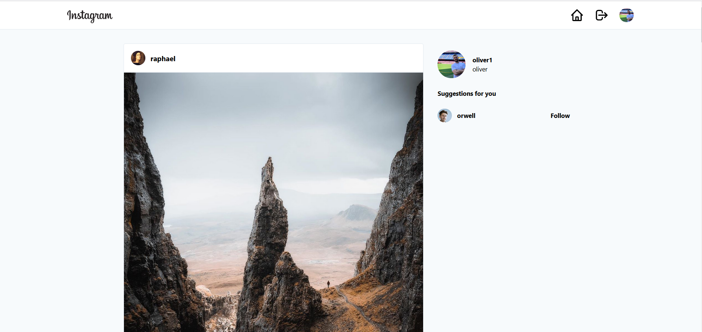
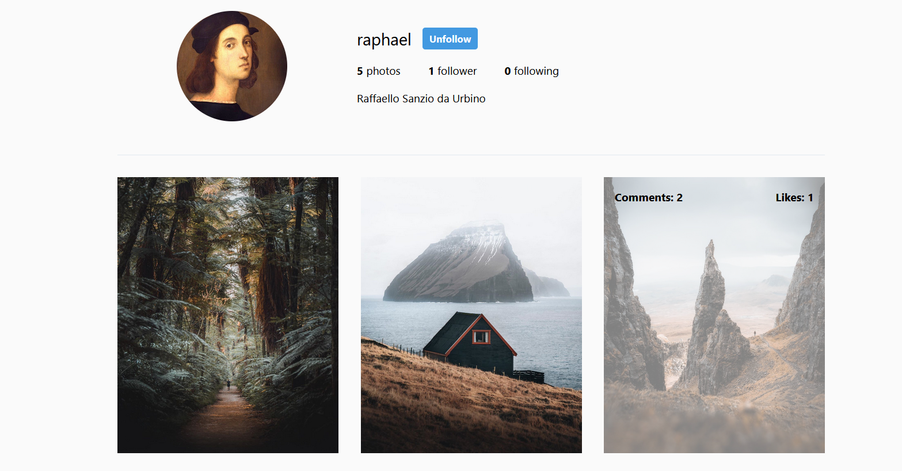
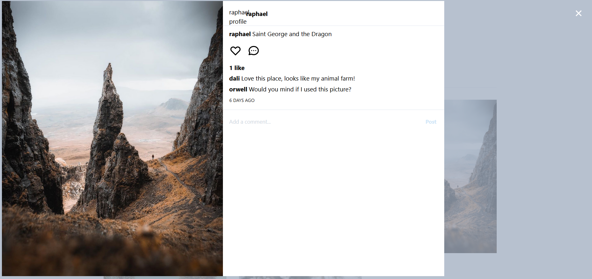
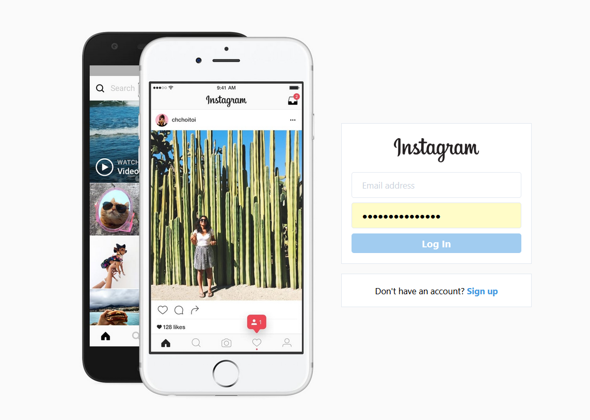
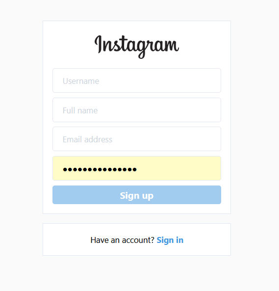

# Instagram Clone

This is a solution to the Instagram Clone Project from Scrimba. 

## Table of contents

- [Overview](#overview)
  - [Project](#the-challenge)
  - [Screenshot](#screenshot)
- [My process](#my-process)
  - [Built with](#built-with)
- [Author](#author)

## Overview

### Project

Creating a Instagram Clone with similar function. 
Including LogIn, SignUp, Pages like Dashboard, Profile, etc. and a Profile Modal.

### Screenshot

Dashboard:

Profile Page:

Profile Modal:

LogIn Page:

SignUp Page:

## My process

### Built with

- React
-- useState, useEffect, useReducer, React Portal, custom hooks, etc.
- React router
- Firebase for Backend
- Tailwind
- Flexbox
- Grid
- Git, Github

## Author

- Oliver (https://github.com/Olli1989/Instagram-Clone)

# Getting Started with Create React App

This project was bootstrapped with [Create React App](https://github.com/facebook/create-react-app).

## Available Scripts

In the project directory, you can run:
